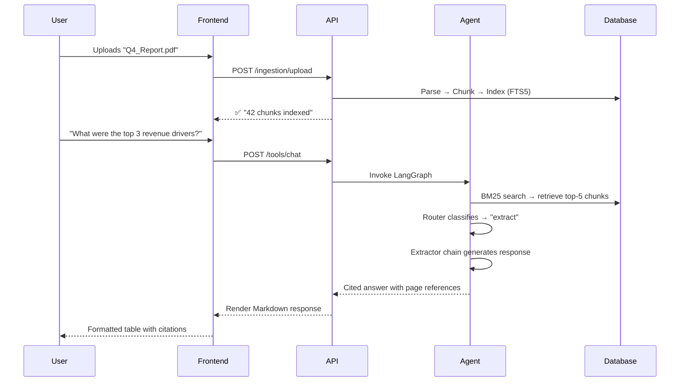

# 🧠 Content Research Agent

### Intelligent Multimodal Document Research, Powered by AI

---

> **One Platform. Any Document. Instant Answers.**
> Upload your files — PDFs, Word docs, spreadsheets, presentations, images, audio, and video — and get instant, AI-powered research insights with cited, verifiable answers.

---

## 📋 Executive Summary

The **Content Research Agent** is a production-ready, AI-powered research platform that transforms how teams interact with their documents and media. Instead of manually reading through hundreds of pages or hours of recordings, users simply upload their content and ask questions in natural language. An intelligent agentic workflow automatically determines the best analytical approach — summarizing, comparing, extracting data, generating insights, or answering questions — and delivers richly formatted, source-cited responses in seconds.

### Who Is This For?

| Audience | Use Case |
|---|---|
| **Legal Teams** | Rapidly analyze contracts, extract clauses, compare agreements |
| **Research Analysts** | Summarize whitepapers, extract statistics, cross-reference studies |
| **Consulting Firms** | Generate insights from client decks, compare proposals, build reports |
| **Media & Content Teams** | Transcribe & search video/audio, caption images, research footage |
| **Operations & Finance** | Extract data from spreadsheets, compare financial documents |
| **Any Knowledge Worker** | Eliminate hours of manual document review |

---

## 🚀 What It Does — Key Capabilities

### 1. 📄 Multi-Format Document Ingestion

Upload virtually any content type. The platform automatically parses, chunks, and indexes everything for instant retrieval.

| Format Category | Supported Types |
|---|---|
| **Documents** | PDF, DOCX, TXT, Markdown (.md) |
| **Presentations** | PPTX (PowerPoint) |
| **Spreadsheets** | XLSX, XLS (Excel) |
| **Images** | JPG, JPEG, PNG, WebP |
| **Audio** | MP3, WAV, M4A |
| **Video** | MP4, MOV, MKV |
| **Raw Text** | Paste text directly into the UI |

### 2. 🤖 Intelligent Agentic Workflow (Auto-Routing)

The platform doesn't use a single, generic prompt. It employs a **LangGraph state machine** that dynamically classifies every user query and routes it to a specialized AI tool chain — ensuring the best possible response format every time.

```
                    ┌─────────────────┐
                    │   User Query    │
                    └───────┬─────────┘
                            │
                    ┌───────▼─────────┐
                    │    Retrieve     │  ← BM25 Full-Text Search
                    │   (Context)     │    (SQLite FTS5)
                    └───────┬─────────┘
                            │
                    ┌───────▼─────────┐
                    │   AI Router     │  ← LLM classifies intent
                    │  (Classifier)   │
                    └───────┬─────────┘
                            │
          ┌─────────┬───────┼───────┬──────────┐
          ▼         ▼       ▼       ▼          ▼
     ┌─────────┐ ┌──────┐ ┌─────┐ ┌────────┐ ┌────┐
     │Summarize│ │Compare│ │Extract│ │Insight│ │ Q&A│
     │  Tool   │ │ Tool  │ │ Tool │ │ Tool  │ │Tool│
     └─────────┘ └──────┘ └─────┘ └────────┘ └────┘
```

#### The 5 Specialized AI Tools

| Tool | What It Does | Example Query |
|---|---|---|
| **🔍 Summarizer** | Condenses large volumes of text into digestible overviews with page/timestamp citations | *"Give me a TL;DR of this 200-page report"* |
| **⚖️ Comparator** | Side-by-side analysis of multiple documents, output as structured Markdown tables | *"Compare pricing across these 3 vendor proposals"* |
| **📊 Extractor** | Precision data extraction — metrics, lists, tables, specific facts | *"Extract all revenue figures from Q4 earnings"* |
| **💡 Insight Generator** | Strategic analysis with actionable recommendations | *"What does this data mean for our go-to-market strategy?"* |
| **❓ Q&A (RAG)** | General factual Q&A grounded strictly in uploaded content | *"What were the key findings on page 42?"* |

### 3. 🎥 Full Multimodal Intelligence

This isn't just a text search tool. The platform **sees images, hears audio, and watches video**.

#### Image Processing
- **Automatic Visual Captioning** — Uses the Salesforce BLIP model to generate natural language descriptions of uploaded images
- **Visual Question Answering (VQA)** — Detects people, estimates demographics, identifies settings, and describes objects using the ViLT model
- Images are indexed and searchable just like text documents

#### Audio Processing
- **Speech-to-Text Transcription** — Uses Groq's Whisper Large V3 Turbo for near-instant, high-accuracy transcription
- **Timestamped Chunks** — Transcriptions are segmented with precise timestamps, enabling playback references in responses (e.g., *"As discussed at [01:23]..."*)

#### Video Processing
- **Dual-Stream Analysis** — Extracts and processes both the audio track (speech-to-text) and visual keyframes (image captioning) independently
- **Keyframe Extraction** — Samples one frame every 10 seconds using FFmpeg, then describes each frame with BLIP
- **Rich Citations** — AI responses can cite specific video timestamps AND embed visual keyframes inline

### 4. 💬 Conversational Memory & Session Management

- **Multi-Conversation Support** — Users can create, rename, and manage multiple research sessions
- **Persistent Chat History** — Every conversation retains full message history; the AI uses prior context for follow-up questions
- **Per-Conversation Document Scoping** — Files are associated with specific conversations, so different research projects don't interfere

### 5. 🔐 Enterprise-Grade Authentication

- **WorkOS AuthKit Integration** — Single Sign-On (SSO) with enterprise identity providers
- **JWT Session Management** — Secure, HttpOnly cookie-based sessions with 24-hour expiry
- **Per-User Data Isolation** — Every conversation and document is scoped to the authenticated user; ownership is verified on every API call
- **Session Revocation** — Server-side session invalidation on logout via WorkOS

### 6. 🖥️ Built-In Premium Frontend

A polished, dark-mode-first web interface is served directly by the backend — no separate frontend deployment needed.

- **Glassmorphic UI Design** — Modern, premium aesthetic with blur effects and smooth transitions
- **Dark/Light Mode Toggle** — Respects system preferences with manual override
- **Inline Media Playback** — Audio/video segments can be played directly from AI citations
- **Markdown Rendering** — Rich AI responses with tables, bold text, lists, and embedded keyframes
- **File Management Sidebar** — Upload, view, and delete files per conversation

---

## 🏗️ Architecture & Tech Stack

### System Architecture Overview

```
┌──────────────────────────────────────────────────────────────┐
│                        CLIENT LAYER                          │
│     Built-in Frontend (HTML/CSS/JS + TailwindCSS)            │
│     OR External Client (any HTTP client / mobile app)        │
└──────────────────────┬───────────────────────────────────────┘
                       │ REST API (JSON)
┌──────────────────────▼───────────────────────────────────────┐
│                     APPLICATION LAYER                         │
│  ┌──────────┐  ┌────────────┐  ┌─────────────┐              │
│  │ Auth     │  │ Ingestion  │  │ Chat/Tools  │   FastAPI     │
│  │ Router   │  │ Router     │  │ Router      │   + Uvicorn   │
│  └────┬─────┘  └─────┬──────┘  └──────┬──────┘              │
│       │              │                │                      │
│  ┌────▼─────┐  ┌─────▼──────┐  ┌──────▼──────────────────┐  │
│  │ WorkOS   │  │ Ingestion  │  │  LangGraph Agent        │  │
│  │ + JWT    │  │ Service    │  │  ┌──────┐ ┌──────────┐  │  │
│  │ Auth     │  │            │  │  │Router│→│Tool Chain│  │  │
│  └──────────┘  │ ┌────────┐ │  │  └──────┘ └──────────┘  │  │
│                │ │Text    │ │  └──────────────────────────┘  │
│                │ │Splitter│ │                                 │
│                │ └────────┘ │                                 │
│                │ ┌────────┐ │                                 │
│                │ │Multi-  │ │                                 │
│                │ │modal   │ │                                 │
│                │ │Pipeline│ │                                 │
│                │ └────────┘ │                                 │
│                └────────────┘                                 │
└──────────────────────┬───────────────────────────────────────┘
                       │
┌──────────────────────▼───────────────────────────────────────┐
│                      DATA LAYER                               │
│  ┌───────────────┐  ┌──────────────┐  ┌──────────────────┐  │
│  │ SQLite + FTS5 │  │ File Storage │  │ Extracted Frames │  │
│  │ (Documents,   │  │ (Uploads)    │  │ (Keyframes)      │  │
│  │  Conversations,│  │              │  │                  │  │
│  │  Messages)    │  │              │  │                  │  │
│  └───────────────┘  └──────────────┘  └──────────────────┘  │
└──────────────────────────────────────────────────────────────┘
                       │
┌──────────────────────▼───────────────────────────────────────┐
│                   EXTERNAL SERVICES                           │
│  ┌────────────────┐  ┌──────────────────┐  ┌──────────────┐ │
│  │ Groq API       │  │ Groq Whisper API │  │ WorkOS       │ │
│  │ (Llama 3.3 70B)│  │ (Speech-to-Text) │  │ (Auth/SSO)   │ │
│  └────────────────┘  └──────────────────┘  └──────────────┘ │
│  ┌───────────────────────────────────────┐                   │
│  │ Local HuggingFace Models              │                   │
│  │ • BLIP (Image Captioning)             │                   │
│  │ • ViLT (Visual Q&A)                   │                   │
│  └───────────────────────────────────────┘                   │
└──────────────────────────────────────────────────────────────┘
```

### Technology Stack

| Layer | Technology | Purpose |
|---|---|---|
| **Web Framework** | FastAPI + Uvicorn | High-performance async REST API server |
| **AI Orchestration** | LangChain + LangGraph | Agentic workflow graph, prompt chains, and tool routing |
| **LLM Provider** | Groq (Llama 3.3 70B) | Ultra-fast inference (~100 tok/s) for all text analysis |
| **Speech-to-Text** | Groq Whisper Large V3 Turbo | Audio/video transcription |
| **Image Understanding** | Salesforce BLIP + ViLT | Local captioning and visual Q&A (no API costs) |
| **Database** | SQLite + FTS5 | Document storage, full-text BM25 search, conversations |
| **Authentication** | WorkOS AuthKit + PyJWT | Enterprise SSO, session management |
| **Document Parsing** | PyPDF, Docx2txt, Unstructured | Multi-format document loading |
| **Video Processing** | FFmpeg | Audio extraction, keyframe sampling |
| **Frontend** | HTML + TailwindCSS + Vanilla JS | Zero-dependency, self-hosted UI |

---

## 🔌 REST API Reference

All endpoints (except `/auth/*`) require authentication via session cookie.

### Authentication

| Method | Endpoint | Description |
|---|---|---|
| `GET` | `/auth/login` | Redirects to WorkOS SSO login |
| `GET` | `/auth/callback` | OAuth callback — sets session cookie |
| `GET` | `/auth/me` | Returns current authenticated user |
| `GET` | `/auth/logout` | Revokes session and clears cookie |

### Document Ingestion

| Method | Endpoint | Description |
|---|---|---|
| `POST` | `/ingestion/upload` | Upload a file (PDF, DOCX, image, audio, video, etc.) |
| `POST` | `/ingestion/paste` | Index raw pasted text content |
| `DELETE` | `/ingestion/file?filename=X` | Remove a specific file and its index |
| `POST` | `/ingestion/reset` | Clear all indexed data for a conversation |
| `GET` | `/ingestion/files/{conversation_id}` | List all files in a conversation |

### Research & Chat

| Method | Endpoint | Description |
|---|---|---|
| `POST` | `/tools/chat` | **Auto-routed** query — AI chooses the best tool |
| `POST` | `/tools/summarize` | Force the Summarizer tool |
| `POST` | `/tools/compare` | Force the Comparator tool |
| `POST` | `/tools/extract` | Force the Extractor tool |
| `POST` | `/tools/insight` | Force the Insight Generator |

### Conversations

| Method | Endpoint | Description |
|---|---|---|
| `POST` | `/tools/conversations` | Create a new conversation |
| `GET` | `/tools/conversations` | List all conversations for the user |
| `GET` | `/tools/conversations/{id}` | Get message history |
| `PUT` | `/tools/conversations/{id}` | Rename a conversation |
| `DELETE` | `/tools/conversations/{id}` | Delete a conversation |

### Interactive API Docs
A fully interactive **Swagger UI** is auto-generated at: `http://localhost:8000/docs`

---

## 🔑 Key Differentiators

### Why This Agent — Not Just ChatGPT?

| Feature | Generic ChatGPT | **Content Research Agent** |
|---|---|---|
| **Data Grounding** | Answers from training data (may hallucinate) | Answers **only** from your uploaded content, with citations |
| **Multimodal** | Text-only input/output | Processes images, audio, video alongside text |
| **Specialized Tools** | One-size-fits-all responses | 5 purpose-built tools auto-selected per query |
| **Data Privacy** | Your data goes to OpenAI | Self-hosted, your data stays on your infrastructure |
| **Document Memory** | Conversation limit, no persistent docs | Persistent document index across sessions |
| **Structured Output** | Freeform text | Tables, lists, cited summaries, embedded media |
| **Enterprise Auth** | API key sharing | SSO via WorkOS, per-user isolation |

### Technical Advantages

- ⚡ **Near-Instant Inference** — Groq's custom LPU hardware delivers ~100 tokens/second with Llama 3.3 70B, making responses feel real-time
- 🔎 **Vectorless Architecture** — Uses SQLite FTS5 (BM25) instead of vector embeddings, eliminating embedding API costs and cold-start latency
- 🏠 **Self-Hosted & Private** — Deploy on your own infrastructure; documents never leave your servers
- 🧩 **API-First Design** — Every capability is accessible via REST API, enabling integration with existing tools and workflows
- 🖼️ **Local Vision Models** — Image captioning and VQA run locally via HuggingFace Transformers — no per-image API charges
- 📦 **Zero-Infrastructure Database** — SQLite requires no database server setup, reducing operational complexity

---

## 📂 Project Structure

```
Content_Research_Agent/
├── main.py                          # Application entry point & server config
├── requirements.txt                 # Python dependencies
├── .env                             # API keys (GROQ_API_KEY, WorkOS keys)
│
├── backend/
│   ├── agent/
│   │   ├── workflow.py              # LangGraph state machine definition
│   │   ├── nodes.py                 # Graph node implementations (router, retrieve, tools)
│   │   └── tools.py                 # Specialized LLM prompt chains (5 tools)
│   ├── config/
│   │   └── settings.py              # Global configuration & directory paths
│   ├── database/
│   │   ├── database.py              # SQLite operations (CRUD, FTS5 search)
│   │   └── retriever.py             # LangChain-compatible retriever interface
│   ├── models/
│   │   └── state.py                 # LangGraph agent state definition
│   ├── routers/
│   │   ├── auth_router.py           # WorkOS authentication endpoints
│   │   ├── ingestion_router.py      # File upload & text paste endpoints
│   │   └── chat_router.py           # Research tools & conversation endpoints
│   ├── schemas/
│   │   └── api_models.py            # Pydantic request/response models
│   ├── services/
│   │   ├── ingestion.py             # Document processing pipeline
│   │   ├── llm.py                   # LLM factory (Groq/ChatGroq)
│   │   └── multimodal/
│   │       ├── image_processor.py   # BLIP captioning + ViLT VQA pipeline
│   │       ├── audio_processor.py   # Groq Whisper transcription pipeline
│   │       └── video_processor.py   # FFmpeg extraction + dual-stream processing
│   └── utils/
│       ├── dependencies.py          # FastAPI dependency injection (auth)
│       ├── exceptions.py            # Global exception handlers
│       └── responses.py             # Standardized API response builder
│
├── frontend/
│   ├── index.html                   # Complete UI (HTML + embedded CSS)
│   └── script.js                    # Frontend application logic
│
└── storage/                         # Runtime data (gitignored)
    ├── uploads/                     # Raw uploaded files
    ├── local_db/                    # SQLite database
    ├── extracted_frames/            # Video keyframe images
    └── temp/                        # Temporary processing files
```

---

## 🚀 Getting Started

### Prerequisites
- Python 3.12+
- FFmpeg (for video/audio processing)
- Groq API Key ([console.groq.com](https://console.groq.com))
- WorkOS Account (for authentication)

### Quick Start

```bash
# 1. Clone & setup
git clone https://github.com/mannmavani1/Content_Research_Agent.git
cd Content_Research_Agent
python -m venv venv && source venv/bin/activate

# 2. Install dependencies
pip install -r requirements.txt

# 3. Configure keys
echo "GROQ_API_KEY=your_key_here" > .env
echo "WORKOS_API_KEY=your_key" >> .env
echo "WORKOS_CLIENT_ID=your_client_id" >> .env

# 4. Launch
uvicorn main:app --reload
```

Access the application at **http://localhost:8000**

---

## 📊 How A Typical Research Session Works



---

## 💼 Deployment Options

| Option | Description |
|---|---|
| **Local / Dev** | `uvicorn main:app --reload` on any machine with Python 3.12+ |
| **Docker** | Containerize with a simple Dockerfile (SQLite file-based, no external DB) |
| **Cloud VM** | Deploy to any cloud provider (AWS EC2, GCP Compute, Azure VM) |
| **Enterprise** | Deploy behind your corporate firewall for maximum data privacy |

> **Note**: Because the platform uses SQLite (file-based) and local HuggingFace models, there is **no need** for a separate database server, vector store service, or embedding API — dramatically reducing infrastructure complexity and cost.

---

## 🛡️ Security Highlights

- ✅ Enterprise SSO via WorkOS AuthKit
- ✅ JWT-based session management with HttpOnly cookies
- ✅ Per-user data isolation with ownership verification on every request
- ✅ Path traversal protection on file serving endpoints
- ✅ Server-side session revocation on logout
- ✅ Self-hosted — data never leaves your infrastructure
- ✅ No data sent to OpenAI — uses Groq (Llama, open-weight model)

---

## 📌 Version

**v1.0.0** — Production-ready release with full multimodal support, enterprise authentication, and agentic research workflow.

---

*Built with ❤️ using FastAPI, LangGraph, Groq, and open-source AI models.*
